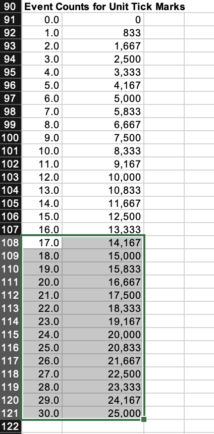
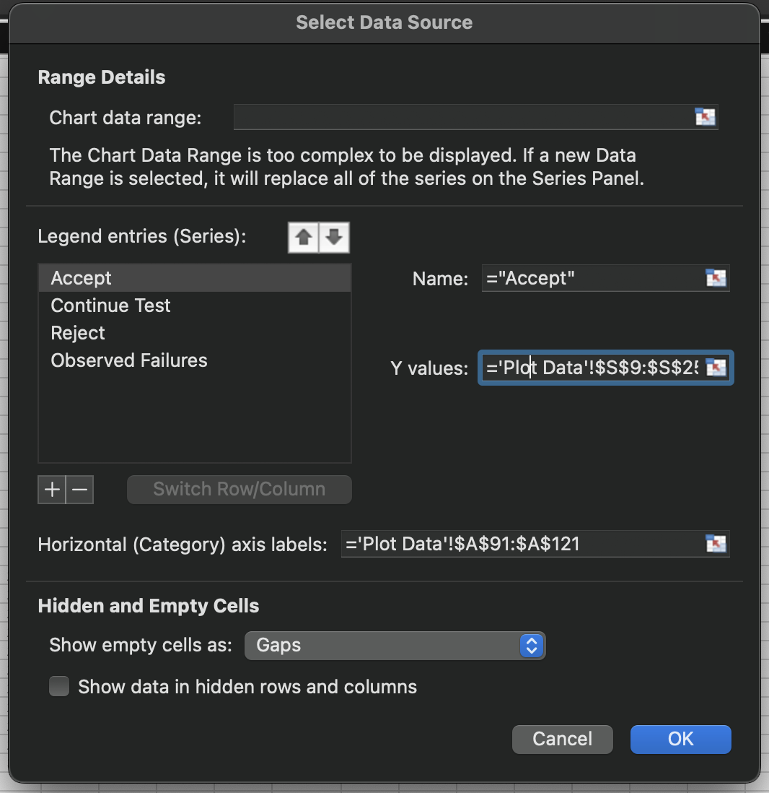

# Step by Step RDC instructions

## 1. "Unprotect" the sheets that need changed
#
* The only sheets that actually need changed in the given excel are the __Failure Data__, __R-Demo-Chart__, and the __Plot Data__ page.
* To unprotect a sheet: 
    1. have the desired sheet selected.
    2. navagate to the tools tab in the app menu and select the "Unprotect Sheet" option under Protection.

* Once completed the sheets should no longer have the lock icons.

 Note: this step may look different on different OSs and Versions of the application.
 
 

## 2. Adding the Failure Data
#
* For the plots of the failure data the only information that is used from the failure reports is the failure time and a index of the failures.
* Copy values from one of the provided failure reports.

 Values aren't all the same as failure report. 

* Paste the value into the darker orange section of the table.
* An issue with the "Normalized (Plotted) X Value" column may occur once the values are inputed. 
    * This can cause issure with plotting the data later, possible a possible issue may be using cut and paste instead of copy paste.

* Finally, ensure the "Normalized (Plotted) X Value" column extends to include all rows of the data. This can be done by selecting the current bottom cell of this column and double clicking the bottom corner.

 
 

## 3. Adjusting R-Demo-Chart for the Failure Data
#
* To have all the new datapoints included in the graph, first select the graph, then navigate to the "Chart Design" tab, click the "Select Data" option.

* Once in the "Select Data Source" window, select the "Observed Failures" which will be one of the listed Series.

* Change the X and Y columns' values to include the cells that were added in the failure data sheet (you should only need to change to last value in the text box).
    * The X values are the "Normalized X Values" column, the Y values is the "Cumulative Failure Count" column.

* Note that once this is done, the plot most likely still won't be visible on the table since the failure rate is by default too high. To fix this for now, the "maximum acceptable number of failures" value or the "per number of events" value in the "Failure Data" sheet.
    * The values 6 and 5000 works for my failure report data.

 
 

## 4. Fixing R-Demo-Chart Y-Axis
#
* The next change needed is to the y-axis so it can fit the data. Right click the y-axis and select the "Format Axis" option.
    * Since for my data I have 30 rows so I change the y range to 0-31.

 
 

## 5. Fixing R-Demo-Chart X-Axis
#
* Fixing the x-axis is a bit more difficult because it also includes fixing the 3 sections.
* First step is adding enough rows to the 3 sections, go to the "Plot Data" sheet and near the bottom in the A column, add enough rows for the number of data points in "Failure Data".

* To then add this increase to the chart, click on the chart in the "R-Demo-Chart" sheet and go back into the "Chart Design" tab -> "Select Data" option, to once again open the "Select Data Source" window.
* Change the "Horizontal (Category) axis labels" upper value to new last column value from "Plot Data".

* The next step is to move the entire table in "Plot Data" so it can fit the nessasary number of rows. For this step make sure to CUT and PASTE, this ensures all connections to used in functions get refactored properly and everything stays connected.

* Again extend the table to match the number of datapoints
* Here in the 8th row of that second column the function ends, so extend from that row to the bottom overriding the extra 16s.

* As seen in the second picture, this will cause an error. The error is because the 9th value is used in the slope calculations used in the formula to determine the rest of the row's values, so change that one cell back to 16.

* On this page extend the final 4 columns starting at the 11th row

* The last thing on the "Plot Data" sheet is change the xmax value to the value chosen for the upper bound of y on the graph (chosen in step 4).

* Then adjust the range of of the series in the graph again to match the new table values. To do this, once more click on the chart in the "R-Demo-Chart" sheet and navagate to "Chart Design" and then "Select Values".
* Once in the window, for each of the Series (Accept, Continue Testing, and Reject), adjust the Y Values Range to include the new values on the table

* Once done for all the series it should look like this.

* Then for the halved and doubled MTTF, just change the values in the "Failure Data" sheet.

